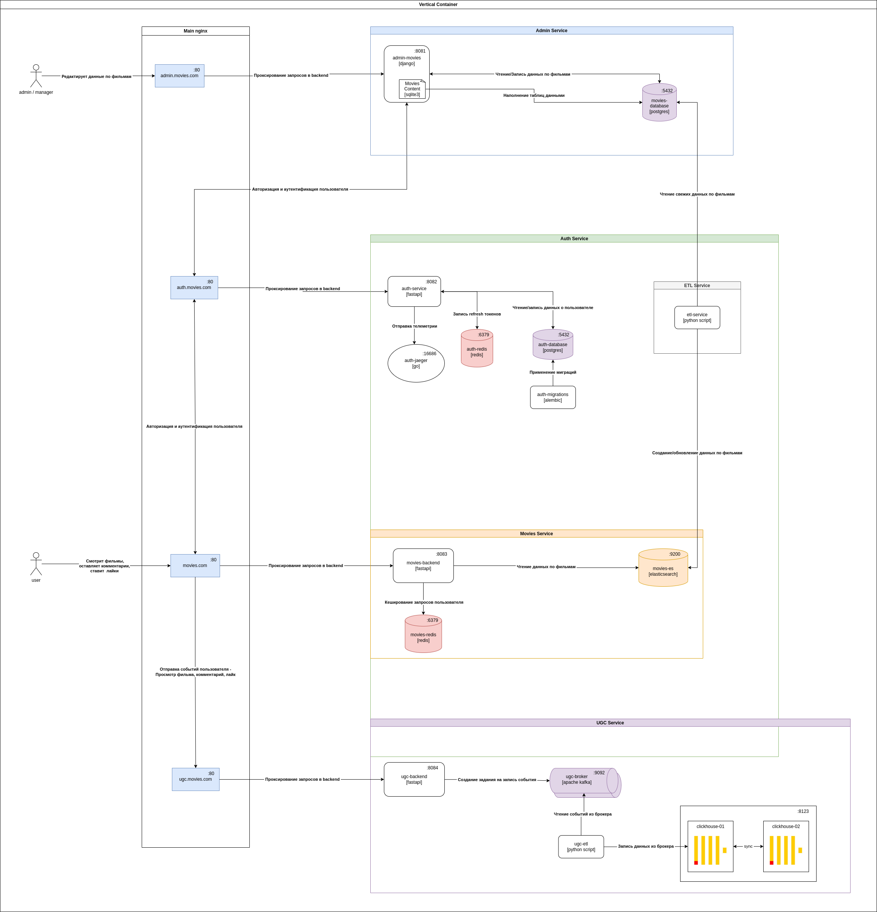

## Описание

## Технологии

Django, FastApi, Postgres, Redis, Kafka, ClickHouse

## Service Diagram

[src](./MoviesArch-Main.drawio.png)

## Описание сервисов

### Admin Service

Сервис по управлению данными кинопроизведений, персон, жанров.

Задачи сервиса:
1. Предоставлять возможность авторизовываться пользователям с административной или менеджерской ролью
2. Предоставлять доступ на создание и редактирование кинопроизведений, персон, жанров
3. todo: Предоставлять доступ по управлению пользователями сервиса - блокировка доступа, назначение ролей, вход под виртуальным пользователем

### Auth Service

Единый сервис авторизации.

Задачи сервиса:
1. Регистрировать пользователей в системе. В том числе и через сторонние сервисы (yandex, vk, google)
1. Предоставлять доступ личным данным пользователя (ФИО, e-mail, и т.п.)
1. Предоставлять доступ на изменение личных данных пользователя.
1. Хранить информацию когда и в какое время был осуществлен вход пользователя на сайт
1. Для администраторов предоставлять доступ на добавление ролей пользователям

Сервис авторизации отдает клиенту access_token. В access_token указаны:
* user_id - Единый идентификатор пользователя в системе
* todo: Роль
* todo: Пермишены

### ETL Service

Внутренний транспортный сервис по переносу данных из БД movies в ES movies.

Задачи сервиса:
1. Своевременно обновлять данные по фильмам для сервиса movies

### Movies Service

Сервис по выдаче контента по кинопроизведениям для пользователей.

Задачи сервиса:
1. Предоставлять доступ авторизованным пользователям к получению информации о кинопроизведений 
1. todo: Предоставляет привилегированный доступ к сервису (просмотр платных фильмов) если у пользователя имеется подписка или специальная роль.

### UGC Service

Сервис хранения пользовательских действий.

Задачи сервиса:
1. Получать и хранить информацию по пользователям - просмотры, комментарии, лайки
1. todo: Предоставлять доступ к аналитике данных пользователей. Доступ должен предоставляться только если у пользователя имеются необходимые привелегии.

## Поведение при выпадении одного из сервисов

Полная деградация? (нет)

* Admin Service - При отказе системы администрирования, остальные сервисы будут работать в штатном режиме
* Auth Service - При отказе системы авторизации, остальные сервисы будут работать в штатном режиме в течении срока действия access токена.
* ETL Service - При отказе, не будут поставляться актуальная информация по фильмам пользователям. Все остальные сервисы будут работать в штатном режиме
* Movies Service - При отказе, пользователи не смогут получать информацию по фильмам. Все остальные сервисы будут работать в штатном режиме
* UGC Service - При отказе, не будет осуществляться запись данных пользователя. Все остальные сервисы будут работать в штатном режиме
* Notify Service - 
