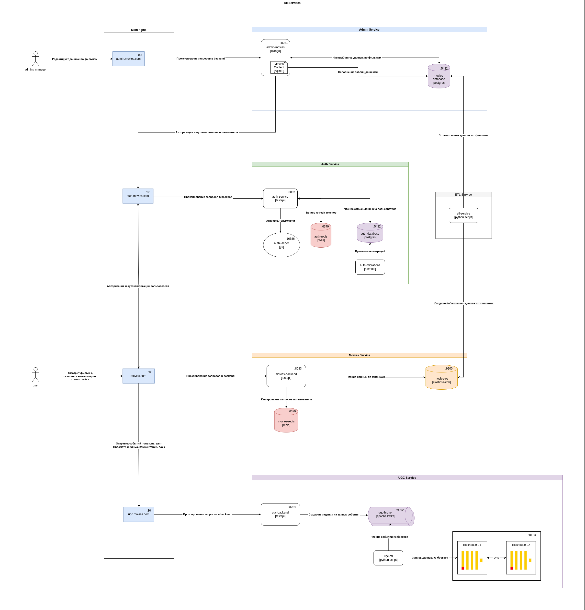

## Описание

## Service Diagram

src = ./MoviesArch.drawio

## Описание сервисов

### Auth Service

Единый сервис авторизации для выдачи контента пользователю.

Задачи сервиса:
1. Хранить информацию о пользователе
2. Предоставлять доступ 

Сервис авторизации отдает клиенту access_token. В access_token указаны:
* user_id - Единый идентификатор пользователя в системе
* name
* email
* Роль
* Пермишены

### ETL Service

Задачи сервиса:
1.  

### Movies Service

Задачи сервиса:
1.  

### UGC Service

Задачи сервиса:
1.  

### Admin Service

Задачи сервиса:
1.  

## Технологии

FastApi, Postgres, Redis, Kafka, ClickHouse

## Поведение при падении одного из сервисов

`¯\_(ツ)_/¯`

